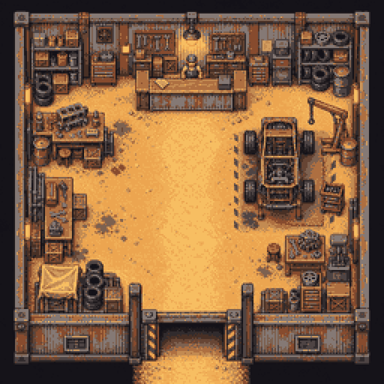

# The game

Dustline is a fixed elevated 2D driving adventure for the Game Boy Advance. Its first priority is the feel of the car: momentum is preserved while coasting, available grip limits steering, and the car's heading can differ from its direction of travel.

## Explore the wasteland

Choose one of seven fixed-seed, 8192 × 8192 procedural maps from the title screen. Each world streams terrain and decoration around the player and connects six outposts with a generated road network.

Ground changes the drive. Loose material produces gentle wander and longer slides, gravel chatters, hardpan adds a light rumble, and roads remain stable. The HUD and physics use the same road-aware surface sample.

## Contracts and races

Outpost job offices offer deterministic contracts:

- **Courier jobs** send the player to another outpost.
- **Marked-raider hunts** identify a target among the roaming drivers.
- **Town races** follow the generated road network between hubs.
- **Wild races** create point-to-point or closed wilderness courses with sequential gates.

Races keep their own state, so accepting a race temporarily suspends the marker and progress for an active contract instead of discarding it.

## Combat and vehicle setups

Enemy drivers share the wasteland with the player. The garage fits front and side weapons, missiles, and deployable traps. Health, a rechargeable shield, and battery energy make combat part of vehicle management rather than a separate mode.

The Handling Lab can adjust acceleration, maximum speed, grip, steering, coast drag, brake force, and mass over broad test ranges. Garage presets provide distinct starting setups.

{ .dustline-screenshot }

## Current prototype

The prototype currently includes:

- a native GBA ROM written in C++ with Butano and devkitARM;
- procedural worlds, streaming terrain, a fixed 2× minimap, outposts, towns, and a garage;
- courier and hunt contracts plus road and wilderness races;
- pooled enemy drivers and garage-fitted weapons;
- original pixel art, synthesized effects, and an adaptive eight-channel soundtrack;
- browser-based map and music workshops used by the game generators.

Cartridge saves, a full inventory and shop economy, dialogue trees, and persistent progression are not implemented yet. The project remains focused on making the driving readable and satisfying before expanding the RPG systems.

