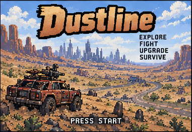
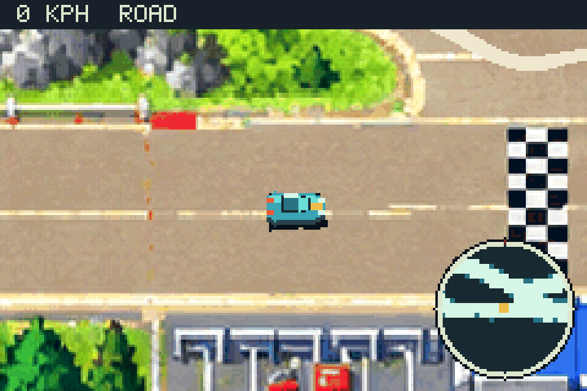
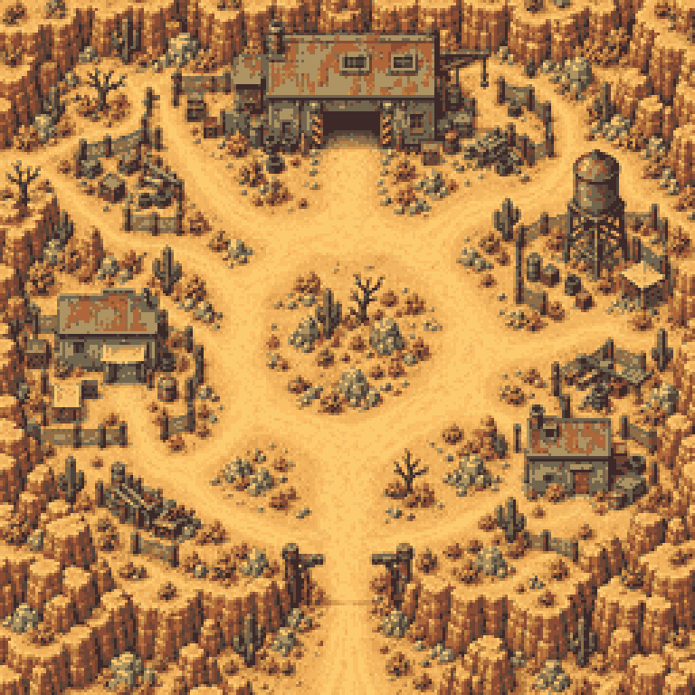

---
hide:
  - toc
---

{ .dustline-wordmark }

# Drive beyond the edge of the map

**Dustline is an original driving and combat RPG prototype built as a real Game Boy Advance ROM.** Cross procedural wastelands, take contracts, race between outposts, tune your vehicle, and fight hostile drivers.

[Download the latest ROM](https://github.com/abhuva/Dustline/releases/latest/download/dustline.gba){ .md-button .md-button--primary }
[Learn how to play](play.md){ .md-button }

{ .dustline-screenshot }

### Momentum matters

Lift before a bend, let the car rotate, then put the power down on exit. Grip, mass, braking, road surfaces, and vehicle setup all shape the handling.

### A wasteland with purpose

Seven fixed-seed worlds combine streaming terrain, roads, outposts, towns, contracts, races, enemies, and a minimap within GBA hardware limits.

### Built for the hardware

The native C++ ROM uses Butano and devkitARM, original pixel art, synthesized effects, and an adaptive eight-channel tracker soundtrack.

## From road to town

{ .dustline-screenshot }

Leave the open wasteland for walkable settlements. Visit the job office for courier and hunt contracts, enter the race office, or head to the garage to change the car setup and fit weapons.

The current build is an in-development prototype. Progress lasts for the current run; cartridge saves, a shop economy, and persistent progression are still ahead. See [what is playable now](game.md) or explore the [developer documentation](development.md).

